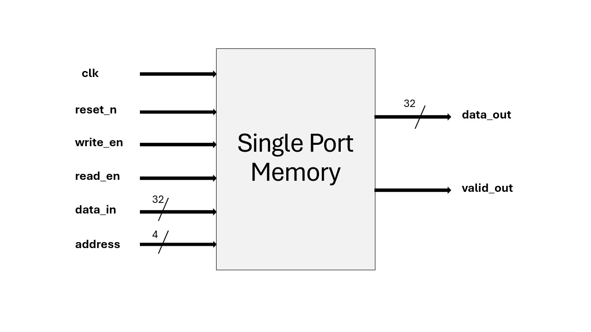
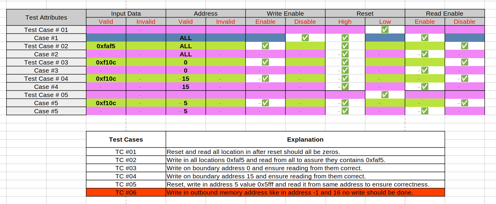
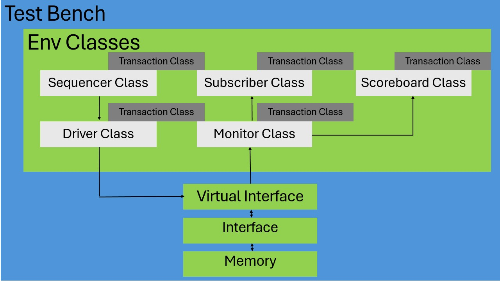
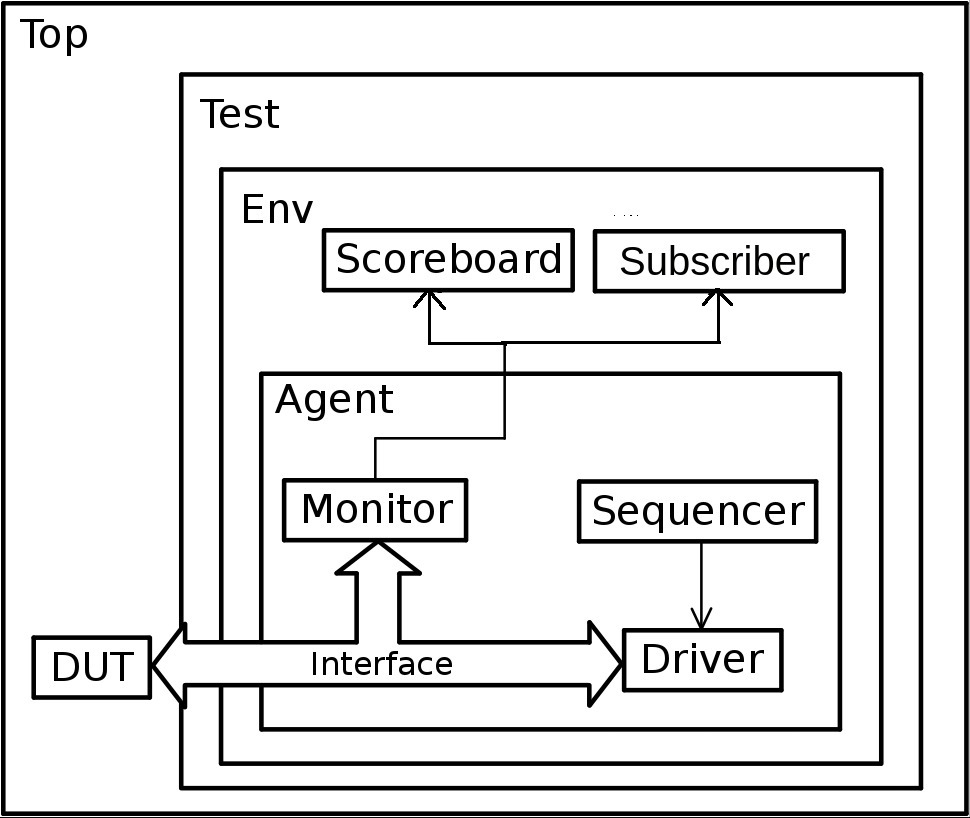

# Memory-Verification-using-UVM
### Overview
This project is focused on creating a class-based verification environment using SystemVerilog and UVM  environment to verify a Single Port Memory module. The project includes the design of a test bench, an interface, and the memory module itself. The primary goal is to ensure the memory module functions correctly by simulating various scenarios through a structured environment.

## Memory Block Diagram 

This diagram represents the Single Port Memory module. It shows the inputs and outputs of the memory, including:
- **clk**: clock signal.
- **reset_n**: active-low reset signal.
- **write_en**: write enable signal.
- **read_en**: read enable signal.
- **data_in [32]**: 32-bit input data bus.
- **address [4]**: 4-bit address bus.
- **data_out [32]**: 32-bit output data bus.
- **valid_out**: output valid signal indicating data availability.

## Test Cases to ensure Functional Coverage

### Test Cases Overview
- **TC #01**: Reset and read all locations after reset all should be zeros.
- **TC #02**: Write to all locations with 0xfaf5 and read from all to ensure they contain 0xfaf5.
- **TC #03**: Write to boundary address 0 and ensure correct reading.
- **TC #04**: Write to boundary address 15 and ensure correct reading.
- **TC #05**: Reset, write value 0x5fff to address 5, and read it from the same address to ensure correctness.
- **TC #06**: Write to an out-of-bound memory address like -1 or 16; no write should occur.

## Class based Env Diagram

This diagram illustrates the architecture of the test bench environment. It includes the following components:

- **Interface**: Encapsulates all input and output signals for the DUT except the clk signal.
- **Virtual Interface**: Acts as an abstraction layer between the test bench components and the memory DUT.
- **Transaction Class**: Encapsulates the data that is transferred between different components.
- **Sequencer Class**: Responsible for generating and managing the sequence of transactions.
- **Driver Class**: Drives the transactions to the DUT (Design Under Test) using the virtual interface.
- **Monitor Class**: Monitors signals and captures the transactions for analysis and send them to Scoreboard and Subscriber.
- **Subscriber Class**: Receives transactions from the Monitor and processes them to collect coverage.
- **Scoreboard Class**: Compares expected and actual results to determine if the DUT behaves as intended.

## General Workflow inside Class Based Environment

1. **Initialization**: The test bench environment is initialized inside top module, setting up all classes, interfaces, and their connections.

2. **Transaction Generation**: The Sequencer generates a sequence of transactions using randomization to test various scenarios such as reads, writes, resets, addresses and data input.

3. **Transaction Execution**: The Driver takes these transactions and map them on the DUT through the Virtual Interface.

4. **Monitoring**: The Monitor observes the execution and sends the captured transactions to the Subscriber and Scoreboard.

5. **Analysis**: The Subscriber processes the transactions and collects coverage.

6. **Validation**: The Scoreboard checks if the actual output matches the expected output, determining if the DUT passes the test.

## UVM Environment Diagram

The UVM environment for verifying the memory block includes the following components:

- **Top**: Sets up the environment and runs the tests.
- **Test**: Contains the test scenarios.
- **Env**: The environment class that instantiates and connects all UVM components.
- **Agent**: The agent that encapsulates the driver, monitor, and sequencer.
- **Sequencer**: Provides a sequence of transactions to the driver.
- **Driver**: Sends input stimuli to the DUT (Device Under Test).
- **Monitor**: Observes the inputs and outputs of the DUT.
- **Scoreboard**: Compares the DUT output with the expected result.
- **Subscriber**: Collect coverage data.
- **Sequence item**: The sequence-item consist of data fields required for generating the stimulus.
- **Sequence**: The sequence generates a series of sequence_item’s and sends it to the driver via sequencer.

## File Structure
    .
    ├── Class Based Env
    │   ├── coverage.sv
    │   ├── driver.sv
    │   ├── env.sv
    │   ├── file.f
    │   ├── if.sv
    │   ├── monitor.sv
    │   ├── package.sv
    │   ├── run.do
    │   ├── scoreboard.sv
    │   ├── sequencer.sv
    │   ├── subscriber.sv
    │   ├── temp.tcl
    │   ├── top.sv
    │   └── transaction.sv
    │
    ├── DUT
    │   └── memory.sv
    │
    ├── UVM Based Env
    │   ├── my_agent.svh
    │   ├── my_driver.svh
    │   ├── my_env.svh
    │   ├── my_if.svh
    │   ├── my_monitor.svh
    │   ├── my_packge.sv
    │   ├── my_scoreboard.svh
    │   ├── my_sequencer.svh
    │   ├── my_sequence.svh
    │   ├── my_subscriber.svh
    │   ├── my_test.svh
    │   ├── sequence_item.svh
    │   └── top.sv
    │
    ├── LICENSE
    └── README.md

## References
- SystemVerilog - IEEE 1800 Standard
- UVM - Cookbook by Siemens Verification Academy
- UVM - Universal Verification Methodology by Siemens Verification Academy
